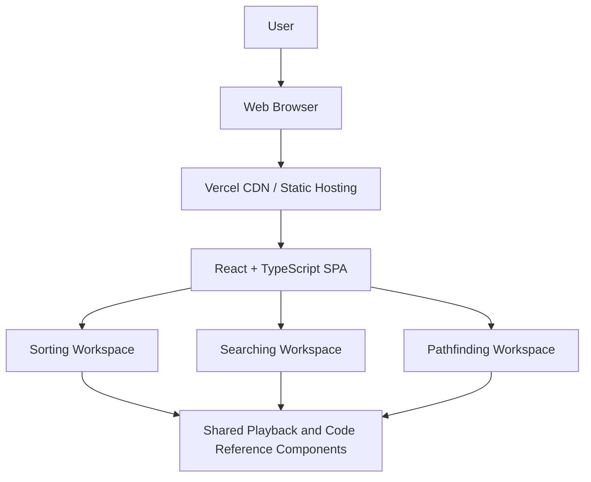
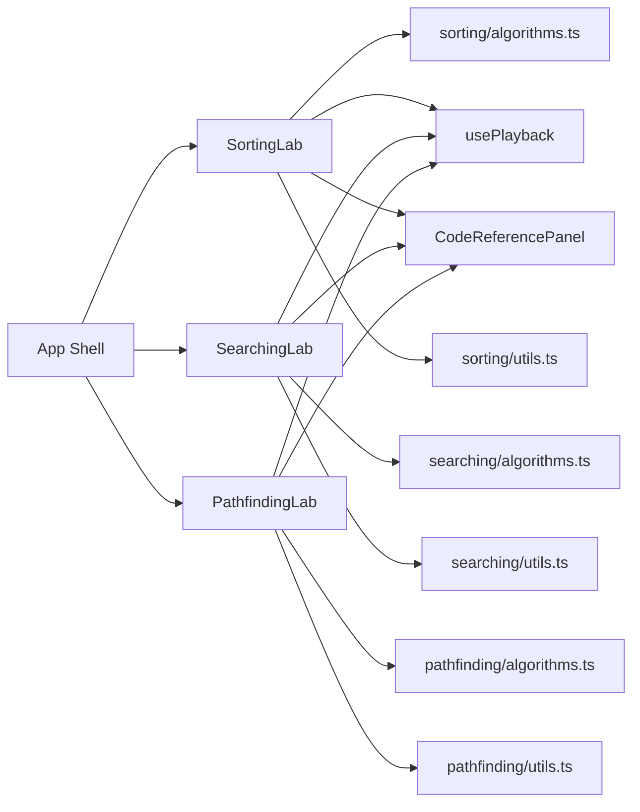

# Architecture Overview

This document describes the top-level architecture of Algorithm Visualizer. It is
intended to explain how the project is structured, why it is structured that
way, and how the major parts collaborate at runtime.

## 1. Architectural Goals

The current architecture is designed around five goals:

1. Make algorithm behavior easy to understand for first-time users.
2. Keep algorithm logic deterministic and independent from rendering.
3. Reuse shared playback and code-explanation patterns across workspaces.
4. Keep the application lightweight by avoiding unnecessary backend complexity.
5. Make the codebase straightforward to extend with new algorithms.

## 2. Architectural Style

The application follows a lightweight frontend architecture:

- Client-side single-page application built with React and Vite
- Feature-based module organization
- Pure algorithm engines that emit execution timelines
- Shared presentational and playback components
- Local state management through React hooks

There is currently no backend API, no database, and no authentication layer.

## 3. System Context Diagram

## 4. Container and Component View

## 5. Major Building Blocks

| Building Block | Responsibility |
| --- | --- |
| `App.tsx` | Controls the active workspace and top-level shell |
| `features/sorting` | Sorting-specific UI, types, utilities, tests, and execution engine |
| `features/searching` | Searching-specific UI, types, utilities, tests, and execution engine |
| `features/pathfinding` | Pathfinding-specific UI, types, utilities, tests, and execution engine |
| `usePlayback` | Shared playback state machine for step navigation |
| `CodeReferencePanel` | Shared implementation reference and stage explanation surface |
| `PlaybackBar` | Shared playback controls |
| `StatPill` | Shared metric display |
| `styles.css` | Global visual system and workspace styling |

## 6. Core Runtime Model

At a high level, each workspace follows the same pattern:

1. Collect and validate user input.
2. Execute a pure algorithm function.
3. Receive a `Run` object containing ordered `Step` snapshots.
4. Feed those steps into shared playback state.
5. Render the current step, metrics, and code explanation.

This is the central design idea of the project:

- Algorithms compute the timeline once.
- The UI only renders the current snapshot.

That separation keeps the visualization layer simple and makes algorithm behavior
easy to test without depending on DOM animation.

## 7. Key Design Decisions

### 7.1 Pure Engine + Snapshot Timeline

Each algorithm engine creates a recorder, appends step snapshots, and returns a
final run summary. This pattern appears in sorting and searching, and the same
resulting shape is used by pathfinding.

Benefits:

- Easy to replay
- Easy to test
- Easy to add stage-specific explanations
- Easy to compare algorithms visually

Tradeoff:

- More intermediate objects are stored in memory than in a streaming approach

### 7.2 Feature-Based Folder Structure

Each workspace owns its:

- types
- utilities
- references
- tests
- UI
- engine logic

This avoids large cross-cutting folders and keeps feature work localized.

### 7.3 Shared Playback and Reference Components

Instead of implementing custom playback logic for every workspace, the project
uses a shared playback hook and shared supporting components. This reduces UI
duplication while allowing each feature to keep its own visualization.

### 7.4 Frontend-Only Deployment

The application is intentionally frontend-only. That keeps hosting simple and
appropriate for the current product scope.

## 8. Risks and Tradeoffs

| Topic | Current Choice | Tradeoff |
| --- | --- | --- |
| State management | Local React state | Simple, but not ideal if the app grows into multi-page persisted workflows |
| Pathfinding frontier | Array sorted on each iteration | Readable implementation, but less efficient than a priority queue |
| Execution model | Precomputed timelines | Excellent for replay, but uses more memory for large inputs |
| Persistence | None | Keeps the app simple, but scenarios cannot yet be saved or shared |

## 9. Recommended Extension Points

The current architecture is a good fit for these next steps:

- Add more algorithms by following the existing feature pattern
- Add line-level code highlighting using `stageId`
- Add scenario serialization and shareable URLs
- Replace pathfinding frontier sorting with a dedicated priority queue
- Add benchmark or complexity comparison views

## 10. Related Documents

- [README.md](README.md)
- [docs/README.md](docs/README.md)
- [docs/HLD.md](docs/HLD.md)
- [docs/LLD.md](docs/LLD.md)
- [docs/DATA_MODEL.md](docs/DATA_MODEL.md)
- [docs/DEPLOYMENT.md](docs/DEPLOYMENT.md)
- [docs/TESTING.md](docs/TESTING.md)
