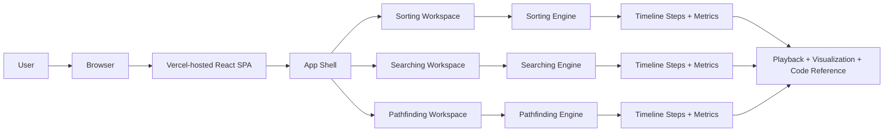

# Algorithm Visualizer

Algorithm Visualizer is a browser-based educational application for exploring
sorting, searching, and pathfinding algorithms through interactive playback.
Users can provide dynamic input, run an algorithm, and inspect every step with
live metrics and synchronized code explanations.

This repository started as a legacy Python + Pygame project and was rebuilt as a
modern React + TypeScript application with a simpler interface and a cleaner
architecture.

## Live Demo

- Production: https://algorithm-visualizer-xi-ten.vercel.app
- Alternate URL: https://algorithm-visualizer-codetitan9999s-projects.vercel.app

## Why This Project Exists

The goal of the project is to make algorithm behavior easier to understand for
students, interview candidates, and first-time learners. Instead of showing only
the final output, the application renders the full execution timeline:

- Dynamic user input for arrays and pathfinding boards
- Step-by-step playback with pause, reset, scrub, and speed control
- Live metrics such as comparisons, writes, checks, frontier size, and path length
- Language-switchable implementation references in TypeScript, Python, Java, and C++
- Clear explanations mapped to the current execution stage

## Supported Workspaces

| Workspace | Algorithms | User Input | Output |
| --- | --- | --- | --- |
| Sorting | Bubble, Insertion, Selection, Merge, Quick | Comma-separated integers or generated arrays | Animated array states, metrics, and stage explanations |
| Searching | Linear, Binary | Comma-separated integers, target value | Checked values, active range, result index, and metrics |
| Pathfinding | A*, Dijkstra | Interactive grid with start, end, and walls | Frontier expansion, visited nodes, path reconstruction, and metrics |

## Architecture At A Glance



The most important architectural choice is that each algorithm produces a
deterministic timeline of steps. The UI does not execute algorithms incrementally
inside animation code. Instead, it renders precomputed snapshots, which improves
testability, replayability, and feature reuse.

## Repository Structure

```text
.
|-- ARCHITECTURE.md
|-- README.md
|-- docs/
|   |-- README.md
|   |-- DATA_MODEL.md
|   |-- DEPLOYMENT.md
|   |-- HLD.md
|   |-- LLD.md
|   `-- TESTING.md
|-- legacy/
|   `-- python-pygame/
`-- src/
    |-- App.tsx
    |-- components/
    |-- hooks/
    |-- types/
    `-- features/
        |-- sorting/
        |-- searching/
        `-- pathfinding/
```

## Documentation Map

| Document | Purpose |
| --- | --- |
| [ARCHITECTURE.md](ARCHITECTURE.md) | Top-level architecture overview and design decisions |
| [docs/README.md](docs/README.md) | Documentation index |
| [docs/HLD.md](docs/HLD.md) | High-level design, system view, and component responsibilities |
| [docs/LLD.md](docs/LLD.md) | Low-level design, sequence flows, and class/module relationships |
| [docs/DATA_MODEL.md](docs/DATA_MODEL.md) | Conceptual ER/data model for the in-memory domain |
| [docs/DEPLOYMENT.md](docs/DEPLOYMENT.md) | Local and production deployment architecture |
| [docs/TESTING.md](docs/TESTING.md) | Testing strategy and verification guidance |

## Tech Stack

- React 19
- TypeScript
- Vite
- Vitest
- CSS
- Vercel

## Core Design Principles

- Deterministic algorithm timelines instead of animation-driven logic
- Feature-based organization so each workspace owns its UI, types, utilities, and engine
- Shared playback and code reference components to reduce duplication
- Local state management with React hooks to keep the app lightweight
- Beginner-friendly UX with direct controls and visible algorithm state

## Getting Started

### Prerequisites

- Node.js 20+ recommended
- npm 10+ recommended

### Install Dependencies

```bash
npm install
```

### Run Locally

```bash
npm run dev
```

Open the local URL printed by Vite in your browser.

### Run Tests

```bash
npm test
```

### Create a Production Build

```bash
npm run build
```

## Available Scripts

- `npm run dev` starts the Vite development server
- `npm test` runs the Vitest test suite
- `npm run build` type-checks the app and creates the production bundle
- `npm run preview` serves the production build locally

## Key Implementation Details

- [src/App.tsx](src/App.tsx) switches between sorting, searching, and pathfinding workspaces.
- [src/hooks/usePlayback.ts](src/hooks/usePlayback.ts) controls play, pause, reset, and scrubbing for every feature.
- [src/components/CodeReferencePanel.tsx](src/components/CodeReferencePanel.tsx) maps execution stages to explanations and language-specific snippets.
- Each feature folder contains its own:
  - `algorithms.ts` for pure execution logic
  - `types.ts` for domain models
  - `reference.ts` for implementation snippets and stage explanations
  - `utils.ts` for validation and scenario helpers
  - `*.test.ts` for algorithm verification

## Testing Summary

The project currently includes automated tests for all algorithm families:

- Sorting tests verify that each implemented sorting algorithm produces the same sorted output.
- Searching tests verify both successful and unsuccessful search behavior.
- Pathfinding tests verify that A* and Dijkstra both find a valid route and agree on path length for the same board.

See [docs/TESTING.md](docs/TESTING.md) for details.

## Deployment Summary

The application is deployed as a frontend-only static site on Vercel:

- No backend service
- No database
- No environment variables required for runtime
- Vite builds the static assets into `dist/`

See [docs/DEPLOYMENT.md](docs/DEPLOYMENT.md) for the full deployment design.

## Legacy Project

The original Python + Pygame implementation is preserved in
`legacy/python-pygame/` for historical reference.

## Future Improvements

- Pseudocode or line-by-line code highlighting during playback
- Additional algorithms such as BFS, DFS, heap sort, and Bellman-Ford
- Weighted pathfinding boards
- Saved scenarios and shareable links
- Benchmark comparison views for larger inputs
