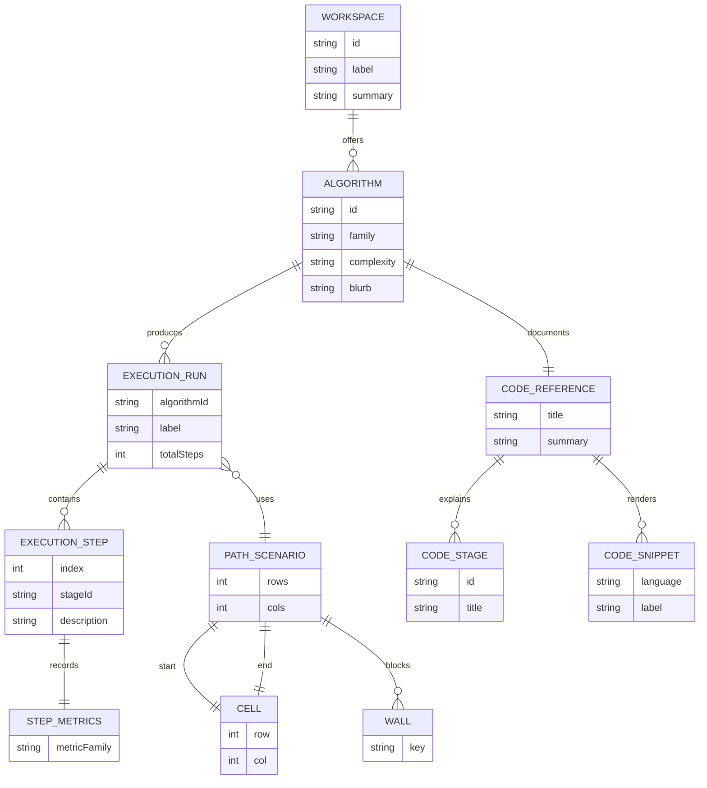

# Conceptual Data Model

Algorithm Visualizer does not currently use a database. This document therefore
describes the conceptual in-memory data model used by the frontend and algorithm
engines.

The purpose of this model is to explain how execution data, metadata, and
references relate to one another.

## 1. Conceptual ER Diagram

## 2. Important Note About the ER Model

This diagram is conceptual rather than physical:

- There are no tables.
- There is no persistence layer.
- Objects exist in memory for the current user session only.

The model exists to communicate relationships, not storage implementation.

## 3. Mapping to TypeScript Types

| Conceptual Entity | TypeScript Mapping |
| --- | --- |
| `WORKSPACE` | `labs` configuration in `App.tsx` |
| `ALGORITHM` | algorithm ids plus metadata in each feature's `algorithms.ts` |
| `EXECUTION_RUN` | `SortRun`, `SearchRun`, `PathRun` |
| `EXECUTION_STEP` | `SortStep`, `SearchStep`, `PathStep` |
| `STEP_METRICS` | `SortMetrics`, `SearchMetrics`, `PathMetrics` |
| `CODE_REFERENCE` | `CodeReference` |
| `CODE_STAGE` | `CodeReferenceStage` |
| `CODE_SNIPPET` | `CodeReferenceSnippet` |
| `PATH_SCENARIO` | `PathScenario` |
| `CELL` | `Cell` |

## 4. Feature-Specific Data Shapes

### 4.1 Sorting Data

Sorting tracks:

- current array values
- active indices
- compared indices
- sorted indices
- optional pivot
- metrics for comparisons, swaps, and writes

### 4.2 Searching Data

Searching tracks:

- current values
- target
- active indices
- checked indices
- discarded indices
- optional search window
- metrics for checks, iterations, and found state

### 4.3 Pathfinding Data

Pathfinding tracks:

- board dimensions
- start and end cells
- wall set
- current cell
- frontier cells
- visited cells
- resolved path
- metrics for visited count, frontier count, path length, and found state

## 5. Why This Model Matters

The conceptual model helps with:

- documentation clarity
- onboarding new contributors
- thinking about future persistence or sharing features
- keeping UI components aligned with engine outputs
