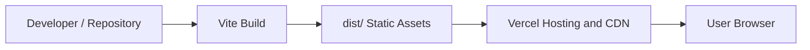

# Deployment Guide

This document describes how Algorithm Visualizer runs locally and in production.

## 1. Current Deployment Model

The project is deployed as a static frontend application on Vercel.

Characteristics:

- frontend only
- no backend service
- no database
- no runtime environment variables required
- build artifacts generated by Vite into `dist/`

## 2. Deployment Diagram



## 3. Local Development Architecture


## 4. Build Pipeline

The production build is created using:

```bash
npm run build
```

This script performs:

1. Type-checking with TypeScript
2. Frontend bundling with Vite
3. Static asset generation in `dist/`

## 5. Runtime Characteristics

At runtime:

- all application logic runs in the browser
- all algorithm execution happens client-side
- visualization state is held in React component state
- execution timelines are computed and rendered per session

## 6. Vercel Notes

The repository is already linked to Vercel, and the live application is exposed
through:

- https://algorithm-visualizer-xi-ten.vercel.app
- https://algorithm-visualizer-codetitan9999s-projects.vercel.app

## 7. Local Commands

### Install

```bash
npm install
```

### Start Local Development Server

```bash
npm run dev
```

### Preview the Production Build Locally

```bash
npm run preview
```

## 8. Operational Checklist

Before deploying changes:

1. Run `npm test`
2. Run `npm run build`
3. Review documentation if architecture or feature scope changed
4. Deploy to Vercel production or preview environment

## 9. Future Deployment Considerations

If the product later adds:

- user accounts
- saved scenarios
- analytics storage
- collaboration features

then the deployment model would likely expand to include:

- backend APIs
- persistent storage
- authentication
- environment variable management
