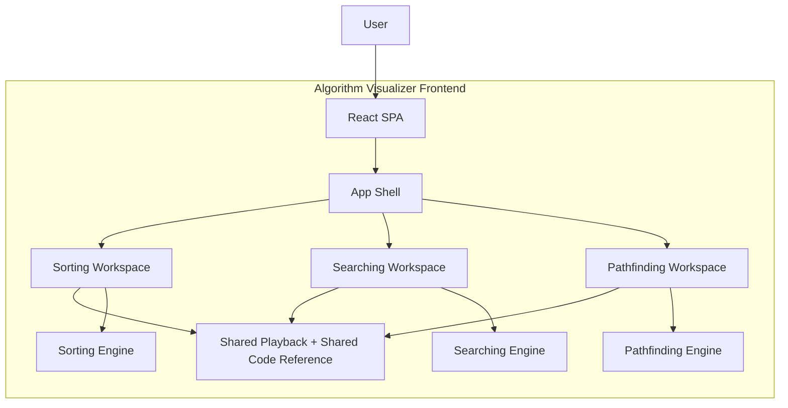
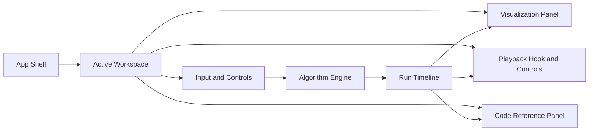
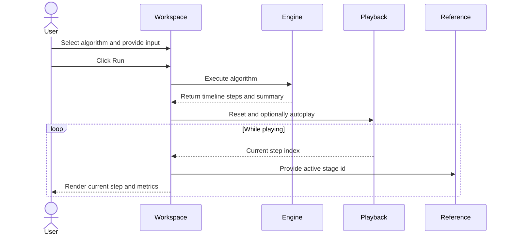

# High-Level Design

This document describes the high-level design of Algorithm Visualizer from a
product and system perspective.

## 1. Scope

Algorithm Visualizer is a frontend-only application that allows users to:

- Enter custom inputs for sorting and searching algorithms
- Configure grid scenarios for pathfinding algorithms
- Run algorithms and inspect every execution step
- Control playback speed and navigation
- Read language-specific implementation references and explanations

## 2. System View

## 3. Workspace Responsibilities

| Workspace | Main Responsibility | Input Style | Visualization Style |
| --- | --- | --- | --- |
| Sorting | Show how arrays become ordered | Array input or generated sample | Bar chart states |
| Searching | Show how a target is discovered or missed | Array input plus target | Search strip with active and discarded ranges |
| Pathfinding | Show how a route is explored and resolved | Editable board | Grid with frontier, visited nodes, and path |

## 4. High-Level Component Responsibilities

| Component | Responsibility |
| --- | --- |
| `App.tsx` | Navigation between workspaces |
| Workspace components | Collect inputs, run engines, connect UI with playback |
| Algorithm engines | Produce deterministic step timelines |
| Utilities | Parse input, generate samples, manage domain helpers |
| Shared playback | Control timeline playback behavior |
| Shared code reference panel | Display algorithm explanation and code in multiple languages |

## 5. HLD Component Diagram

## 6. Primary User Journey

The most important product flow is:

1. User selects a workspace.
2. User configures an input scenario.
3. User selects an algorithm.
4. User clicks `Run`.
5. The workspace generates a run timeline.
6. The UI plays back snapshots and highlights the current step.
7. The code reference panel explains the current stage.

## 7. Non-Functional Priorities

### 7.1 Usability

The UI is intentionally simple and beginner-friendly. The most important visual
information is always the current algorithm state.

### 7.2 Determinism

Given the same input, each algorithm produces the same ordered timeline. This is
important for both learning and testing.

### 7.3 Extensibility

New algorithms can be added by introducing:

- a new algorithm id
- a corresponding run generator
- reference content
- tests
- optional workspace UI updates

### 7.4 Testability

Pure algorithm engines can be tested independently from React components.

## 8. High-Level Runtime Flow

## 9. Scaling Notes

The current architecture scales well for educational feature growth, but not yet
for large product-platform concerns such as:

- user accounts
- saved scenarios
- collaborative sessions
- server-driven analytics

Those additions would likely introduce:

- persistent storage
- API endpoints
- authentication
- routing beyond a single-page shell
