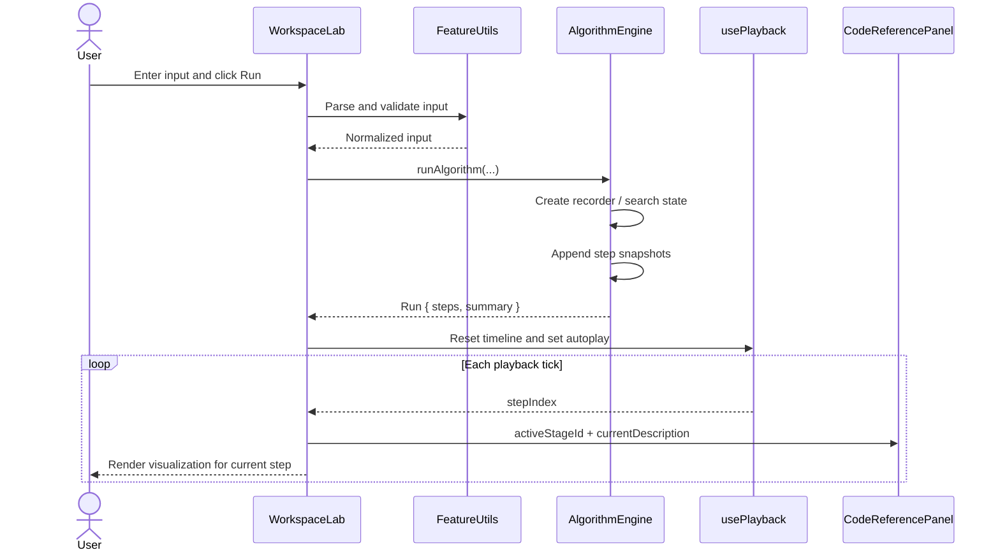
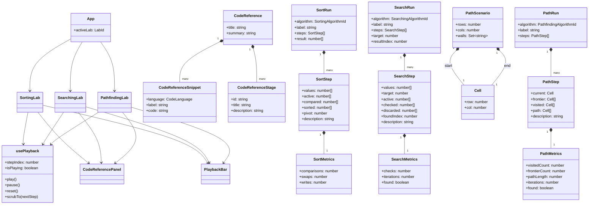

# Low-Level Design

This document describes the module-level implementation design of Algorithm
Visualizer.

## 1. Module Layout

```text
src/
|-- App.tsx
|-- main.tsx
|-- styles.css
|-- components/
|   |-- CodeReferencePanel.tsx
|   |-- PlaybackBar.tsx
|   `-- StatPill.tsx
|-- hooks/
|   `-- usePlayback.ts
|-- types/
|   `-- codeReference.ts
`-- features/
    |-- sorting/
    |   |-- SortingLab.tsx
    |   |-- algorithms.ts
    |   |-- algorithms.test.ts
    |   |-- reference.ts
    |   |-- types.ts
    |   `-- utils.ts
    |-- searching/
    |   |-- SearchingLab.tsx
    |   |-- algorithms.ts
    |   |-- algorithms.test.ts
    |   |-- reference.ts
    |   |-- types.ts
    |   `-- utils.ts
    `-- pathfinding/
        |-- PathfindingLab.tsx
        |-- algorithms.ts
        |-- algorithms.test.ts
        |-- reference.ts
        |-- types.ts
        `-- utils.ts
```

## 2. Shared Interaction Pattern

All three workspaces follow the same low-level flow:

1. Parse or update input state.
2. Run a pure algorithm function.
3. Store a `Run` object in local React state.
4. Pass run length to `usePlayback`.
5. Render the current step using `stepIndex`.
6. Map `stageId` to the code reference panel.

## 3. Execution Sequence



## 4. Class Diagram



## 5. Feature-Level Design Notes

### 5.1 Sorting

The sorting engine uses a recorder pattern:

- `createRecorder(values)` initializes mutable working state and metrics.
- `snapshot(...)` appends a `SortStep`.
- `buildRun(...)` wraps final metadata and summary into a `SortRun`.

This keeps the sorting algorithms readable while still producing a uniform output
shape for the UI.

### 5.2 Searching

Searching follows a very similar recorder approach, but adds:

- `target`
- checked indices
- discarded indices
- an optional active search window

Binary search also performs an important normalization step:

- if the input is not sorted, it sorts the values first
- it adds `inputNote` so the UI can explain that behavior to the user

### 5.3 Pathfinding

Pathfinding uses a slightly different internal model:

- `PathScenario` represents the board configuration
- the engine tracks frontier, visited nodes, parent links, and costs
- `createPathPreviewRun(...)` provides a pre-run placeholder state
- `runPathfindingAlgorithm(...)` returns the full resolved timeline

The frontier is implemented with an array that is sorted each iteration. That is
simple and readable, though not as efficient as a dedicated priority queue.

## 6. Shared Hook Design

[src/hooks/usePlayback.ts](../src/hooks/usePlayback.ts) is a shared playback
state machine with:

- `stepIndex`
- `isPlaying`
- `play()`
- `pause()`
- `reset()`
- `scrubTo(nextStep)`

It uses `timelineKey` to reset playback whenever a new run is loaded.

## 7. Shared Reference Design

[src/components/CodeReferencePanel.tsx](../src/components/CodeReferencePanel.tsx)
accepts:

- a `CodeReference`
- the selected language
- the active `stageId`
- the current description

This allows every workspace to reuse the same explanation surface while still
showing workspace-specific stage text.

## 8. Low-Level Extension Guide

To add a new algorithm cleanly:

1. Extend the feature's algorithm id union in `types.ts`.
2. Add metadata and a new run function in `algorithms.ts`.
3. Add reference snippets and stage explanations in `reference.ts`.
4. Expose the option in the workspace UI.
5. Add or update tests for correctness.
